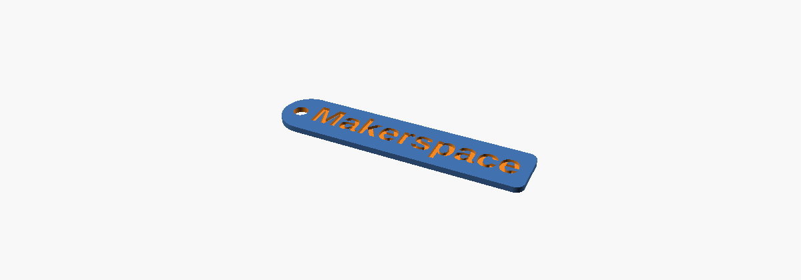

# Namensschild-Generator (OpenSCAD → STL)

Parametrische, 3D-druckbare Namensschilder:

- Rechteckig, flach – standardmäßig **2 mm** dick
- Ein kurzes Ende **abgerundet**, mit einem **Loch für einen Schlüsselring** an diesem Ende
- Der Name wird **vertieft** ("invers") in die Oberseite eingraviert, **1 mm** tief
- Die **Länge passt sich automatisch** an den Namen an – nichts wird abgeschnitten



*Beispiel: erzeugt mit `name="Makerspace"` – das Loch sitzt am abgerundeten Ende,
der Text ist vertieft eingraviert, die Länge passt sich automatisch an.*

## Voraussetzungen

- [OpenSCAD](https://openscad.org/) (getestet mit Version 2026.06). Die automatische
  Längenanpassung nutzt die experimentelle Funktion `textmetrics()`, daher ist auf der
  Kommandozeile das Flag **`--enable=textmetrics`** erforderlich.

## Schnellstart

### Ein einzelnes Schild über die Kommandozeile

```sh
openscad --enable=textmetrics -D 'name="Falk"' -o falk.stl nametag.scad
```

> Anführungszeichen: die äußeren einfachen `'...'` sind für die Shell, die inneren
> doppelten `"..."` sind der OpenSCAD-Text. Namen mit Leerzeichen funktionieren:
> `-D 'name="Anna Schmidt"'`.

### Mehrere Schilder auf einmal

**macOS / Linux:**

```sh
./generate.sh                 # erzeugt jeden Namen aus names.txt -> out/*.stl
./generate.sh "Anna" "Jörg"   # oder Namen direkt übergeben
```

**Windows** – `generate.bat` doppelklicken, oder im Terminal:

```powershell
.\generate.bat                  # erzeugt jeden Namen aus names.txt
.\generate.bat "Anna" "Jörg"    # oder Namen direkt übergeben
# (entspricht: powershell -ExecutionPolicy Bypass -File .\generate.ps1)
```

> Namen mit Umlauten/Akzenten unter Windows am besten in `names.txt` schreiben
> (wird als UTF-8 gelesen) – als Kommandozeilen-Argument können die Zeichen je nach
> Konsolen-Codepage verstümmelt werden.
>
> Falls OpenSCAD nicht gefunden wird, vorher den Pfad setzen:
> `$env:OPENSCAD = "C:\Program Files\OpenSCAD\openscad.exe"`

Die STL-Dateien landen in `out/`, benannt nach einer bereinigten Version des Namens
(Kleinbuchstaben, Leerzeichen → `_`, Umlaute/Akzente bleiben erhalten – z. B.
`Jörg` → `jörg.stl`; nur für Dateinamen unzulässige Zeichen wie `/ : * ?` werden entfernt).

### In der OpenSCAD-Oberfläche

1. `nametag.scad` öffnen.
2. Den Wert `name` oben in der Datei ändern (oder das **Customizer**-Fenster nutzen).
3. **F6** drücken zum Rendern, dann **Datei → Exportieren → Als STL exportieren**.
   *(Beim Rendern in der Oberfläche ist `textmetrics` automatisch aktiv – kein Flag nötig.)*

## Parameter

Jeden Wert auf der Kommandozeile mit `-D 'parameter=wert'` überschreiben oder oben in
`nametag.scad` bearbeiten.

| Parameter    | Standard                       | Bedeutung                                          |
|--------------|--------------------------------|----------------------------------------------------|
| `name`       | `"Sample"`                     | einzugravierender Text                             |
| `font`       | `"Liberation Sans:style=Bold"` | Schriftart (`Familie:style=...`)                  |
| `text_size`  | `9`                            | Schriftgröße (mm)                                 |
| `text_depth` | `1`                            | Gravurtiefe (mm)                                  |
| `thickness`  | `2`                            | Dicke / Höhe des Schilds (mm)                     |
| `tag_width`  | `18`                           | kurze Seite / Höhe des Schilds (mm)              |
| `hole_d`     | `5`                            | Durchmesser des Schlüsselring-Lochs (mm)          |
| `hole_inset` | `tag_width/3`                  | Abstand der Lochmitte zur abgerundeten Spitze (mm); kleiner = näher am Rand |
| `corner_r`   | `3`                            | Eckenradius am geraden Ende (mm); `0` = scharf    |
| `text_gap`   | `3`                            | Abstand zwischen Loch und Textbeginn (mm)         |
| `end_pad`    | `4`                            | zusätzliche Länge hinter dem Text (mm)            |
| `$fn`        | `64`                           | Glättung der Rundungen (höher = feiner)           |

Beispiel – dickeres Schild, größeres Loch, andere Schrift:

```sh
openscad --enable=textmetrics \
  -D 'name="Werkstatt"' -D 'thickness=3' -D 'hole_d=6' \
  -D 'font="DejaVu Sans:style=Bold"' \
  -o werkstatt.stl nametag.scad
```

## Tipps zum Drucken

- Die Gravur druckt sauber ohne Stützstrukturen (Schild liegt flach, Text oben).
- Für mehr Kontrast einen **Farbwechsel des Filaments** in den obersten Schichten
  einstellen (im Slicer) oder die Vertiefung ausmalen.
- `text_depth = 1` bei einem `2 mm` dicken Schild lässt einen `1 mm` Boden stehen –
  stabil. `text_depth` immer kleiner als `thickness` halten.

## Dateien

- `nametag.scad` – das parametrische Modell
- `generate.sh` – Generator für einzelne + mehrere STLs (macOS / Linux)
- `generate.ps1` – Generator für einzelne + mehrere STLs (Windows / PowerShell)
- `generate.bat` – Doppelklick-Starter für `generate.ps1` unter Windows
- `names.txt` – Beispiel-Namensliste für den Stapelbetrieb
- `out/` – erzeugte STL-Dateien (wird beim ersten Lauf angelegt)

## Fehlerbehebung

- **„Can't open input file …" / OpenSCAD wird nicht gefunden (Windows):**
  Sicherstellen, dass OpenSCAD installiert ist. Notfalls den Pfad explizit setzen:
  `$env:OPENSCAD = "C:\Program Files\OpenSCAD\openscad.exe"`. Das Skript gibt beim Start
  `Project folder:` und `Using OpenSCAD:` aus – so sieht man, was verwendet wird.
- **„running scripts is disabled" (Windows):** Über `generate.bat` starten, oder
  `powershell -ExecutionPolicy Bypass -File .\generate.ps1` verwenden.
- **Detaillierte Diagnose (Windows):** Vor dem Lauf `$env:NAMETAG_DEBUG = "1"` setzen –
  dann werden Arbeitsverzeichnis und Argumente ausgegeben.
- **`textmetrics`-Warnung / Name wird nicht angepasst:** Das Flag `--enable=textmetrics`
  fehlt. Die mitgelieferten Skripte setzen es bereits automatisch.
- **Umlaute im Namen:** Funktionieren mit den Standardschriften. Unter Windows die Namen
  in `names.txt` (UTF-8) schreiben statt als Kommandozeilen-Argument.
